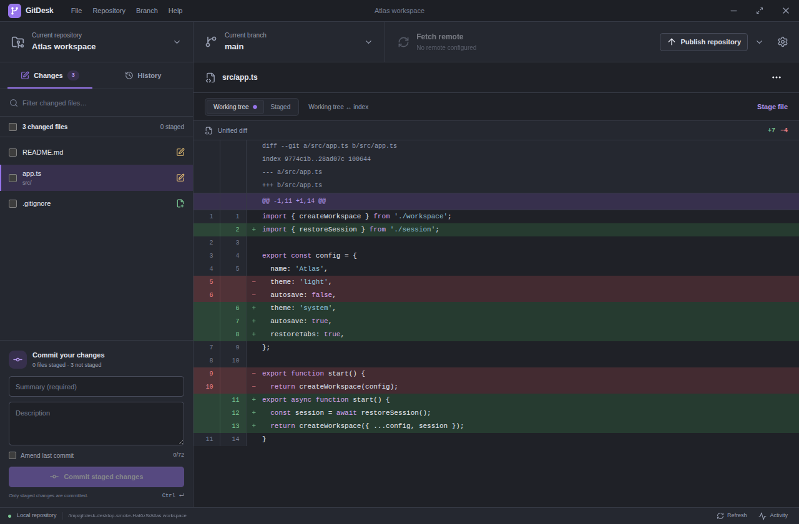
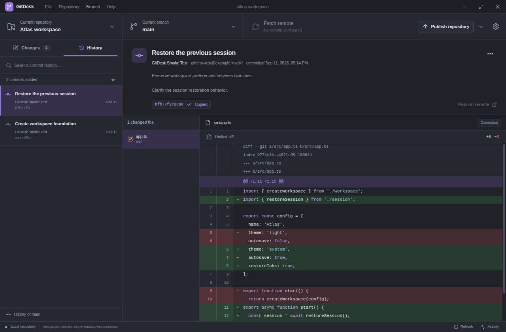
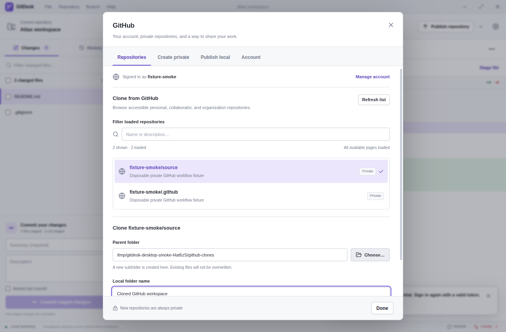

# GitDesk

A standalone, local-first desktop Git client with a familiar two-pane workflow.
GitDesk uses **real system Git**, not a simulated repository. Optional GitHub
account features use GitHub's API; ordinary Git workflows remain provider-independent.
Its interface, branding, and icon are original; it is not affiliated with GitHub.

## Screenshots

### Review and stage changes



| Browse commit history | Browse GitHub repositories |
| --- | --- |
|  |  |

## Run

Requirements: **Git 2.30+**, **Node.js 24 LTS**, and a graphical desktop.
Git must be available on the application's `PATH`.

```sh
npm install
npm run build
npm start
```

For development, run `npm run dev`. Vite reloads renderer changes; restart this
command after changing the main process or preload.

On Linux, after packaging:

```sh
npm run package:linux
./release/linux-unpacked/gitdesk
```

`release/GitDesk-0.1.0-x64.tar.gz` is a portable distribution: extract the **entire**
archive and run `gitdesk` from the extracted folder. Keep its resources beside
the executable. It bundles Electron and does not require Node or npm at runtime.
System Git is still required. `./gitdesk.sh` runs the packaged app if present,
otherwise the built source app.

This checkout also has a project-local Node toolchain, if Node is not installed:

```sh
export PATH="$PWD/.tools/node-v24.21.0-linux-x64/bin:$PATH"
npm run dev
```

The toolchain is local and ignored by Git; it is not part of the source
distribution. No global package or operating-system setting is changed.

## Workflow

- **Repositories:** add an existing working tree, initialize a new named folder,
  or clone into a new folder. The repository picker remembers the recent
  selection. Removing a repository from GitDesk **does not delete it**.
- **Changes:** inspect working-tree and staged diffs separately, including
  additions, deletions, renames, untracked and conflicted files. Checkboxes
  stage/unstage whole files. A partially staged file retains separate staged and
  working-tree views. Commits use **only the existing index**, with summary,
  description and explicitly confirmed amend (including message-only amendments).
- **History:** paginated, searchable commit history, changed files, unified
  diffs, full commit IDs, remote links, revert, cherry-pick and intentional
  detached checkout.
- **Branches:** local/remote branches, create, switch, rename and safe delete,
  merge and rebase, upstream information and ahead/behind counts.
- **Synchronization:** explicit fetch, pull with merge or rebase, push/publish,
  and separately confirmed force-with-lease. No network operation runs merely
  because you open the app.
- **Stashes and conflicts:** stash tracked work with optional untracked files;
  apply/pop/drop; inspect active merge/rebase/cherry-pick/revert, edit conflicting
  files, choose a side, mark resolved, continue or abort.
- **Settings:** light/dark/system appearance, default initial branch,
  repository-local Git identity, and remotes. Open the repository in a file
  manager, supported editor or terminal. Progress and errors appear in the
  activity panel; running Git commands can be cancelled.

The app refreshes after operations and on focus, and checks for external changes
while open. It never updates global Git configuration. Identity is changed only
when you explicitly save repository settings.

## Safety and authentication

**Stage means include in the next commit.** GitDesk respects pre-existing staged
content. It does not silently add excluded files to a commit. File staging is
whole-file; staging individual lines/hunks is not implemented.

**Discard is irreversible.** It discards only the selected file's unstaged
changes, restoring from the index where possible and preserving staged content.
Discarding a selected untracked file removes that exact file. There is no broad
`git clean` or automatic worktree reset. Commit amend, destructive conflict-side
selection, operation abort, stash drop, branch deletion, remote removal and
force push require deliberate confirmation. Dirty work is never automatically
discarded to switch, merge or rebase.

**Force push uses `--force-with-lease`, never `--force`.** It does not fetch just
before forcing. If the remote changed since the locally observed tracking tip,
the push is rejected. Review the new remote work before deciding how to proceed.
Cancelling a command terminates its process, but cannot undo work Git or the
remote server already completed; inspect the refreshed repository afterwards.

**Company GitLab / HTTPS sign-in:** open **Settings → HTTPS authentication** and
enter the full repository URL, your **email or username**, and **password or
personal access token**. The same controls are available in Clone and Sync
dialogs. This works with company-hosted GitLab and other HTTPS Git servers;
it does not require a GitHub account. Use the login accepted by your server.
GitLab instances using 2FA, SSO or restricted password authentication may require
a token (`read_repository` for clone/fetch, `write_repository` for push).
GitHub requires a username and token instead of an account password.

Choose **Use credentials for this session**, then run your Git operation.
Saving the form prepares credentials; it does not claim that the server accepted
them. Wrong credentials produce an authentication error. **Forget session
credentials** removes them. TLS certificate verification remains enabled; for
company certificate authorities, configure your normal Git trust store.

Session credentials use a private **in-memory Git credential-cache**, scoped
to the exact HTTPS repository URL. They expire after one hour without use and
are cleared on normal app exit. After an abnormal termination, the cache's
one-hour expiry still applies. Passwords are sent over a pipe to Git—not in
arguments, environment variables, repository URLs, app settings or Git config.
Existing helpers (including plaintext `store`) are bypassed for these sessions,
and raw remote diagnostics are omitted to keep secrets out of Activity.
Authenticated requests do not follow redirects: use the final HTTPS clone URL
provided by your GitLab instance.

Without session or GitHub account credentials, GitDesk continues to use your installed Git
credential helpers, SSH agent/configuration and signing configuration. There is
no persistent password database. In-app session
credentials require Git credential-cache on Linux/macOS; Windows users should
configure Git Credential Manager. Terminal credential prompts remain disabled
to avoid invisible hangs. Credential, host-key and signing problems are reported
as errors. A credential helper or signing program requiring a GUI must be
independently configured.
Existing Git hooks and filters may execute under your account, just as with
command-line Git: add only repositories you trust.

The renderer is sandboxed, with context isolation, Node integration disabled,
a restrictive content security policy, denied navigation and a narrow validated
IPC bridge. Git and filesystem access stay in the main process. Operations use
argument arrays and literal paths rather than shell strings, and mutations are
serialized per repository.

## GitHub accounts and private repositories

Open **File → GitHub repositories…** (also available from the repository picker,
welcome screen and Settings). Company GitLab authentication remains independent.

- **Token sign-in:** enter a GitHub personal access token, not your account
  password. A classic token with `repo` scope supports private repositories.
  A fine-grained token needs access to the relevant repositories, **Contents:
  read/write** for Git pushes and **Administration: read/write** for creation;
  account/organization policies and SSO may impose additional restrictions.
  Pushing GitHub Actions workflow files additionally needs the token's `workflow`
  scope (classic) or Workflows permission (fine-grained).
- **Import GitHub CLI login:** explicitly imports the existing `gh auth login
  --hostname github.com` account. `gh` must be on `PATH`. GitDesk does not run
  `gh auth login`, alter CLI configuration, or import launcher-injected token
  environment variables.
- **Browser/device sign-in:** requires a registered OAuth application's public
  client ID with device flow enabled. Enter it in the advanced browser login
  controls, or launch with `GITDESK_GITHUB_CLIENT_ID=your_client_id ./gitdesk.sh`.
  GitDesk does not ship another application's OAuth identity or a client secret.
  Without your own client ID, use token or CLI sign-in. Approve the displayed
  code at GitHub in your normal browser. Expiring OAuth sessions require signing
  in again; automatic refresh tokens are not supported.

Token verification is explicit. Credentials stay in the main process and are
never returned to the renderer. **Remember me** is optional and only available
with OS-backed encryption (Linux `basic_text` fallback is refused); otherwise
the account lasts only for this app session. The encrypted account file is
`github-account.enc` in the app profile. Account restore does not make a network
request. Sign out deletes GitDesk's stored account without signing out the CLI
or changing GitLab credentials. It does not revoke the token on GitHub.

The repository browser loads accessible personal, collaborator and organization
repositories in pages of 50. Filtering searches **loaded pages only**; load more
to include additional results. Cloning uses a new local folder and the account's
HTTPS credential. On Linux/macOS, account credentials also apply to normal
GitHub HTTPS fetch/pull/push, through an isolated, repository-scoped in-memory
cache cleared after each operation. Redirects and existing credential helpers
are disabled for these authenticated operations. SSH still uses your SSH agent.
On Windows, API account features work, but automatic GitHub token-to-Git
authentication requires the currently unsupported in-app credential cache;
configure Git Credential Manager and use ordinary URL clone/sync instead.

**Create private repository** creates an empty private repository under your
personal account, with an explicit confirmation and a link to the result. It
does not initialize local files. Organization-owned or public creation is not
implemented.

**Publish repository** creates a private personal repository, adds an **unused**
remote name and pushes **only the current branch and its history**, setting its
upstream. It requires at least one commit, attached HEAD, a clean working tree,
no active operation and no existing upstream/custom push destination. It never
stages, commits, overwrites a remote, force pushes or uploads all branches/tags.
For a branch that already has an upstream, create a new local branch without
tracking first, or use Create and configure the remote explicitly with Git.
If GitHub creation succeeds but pushing fails, the remote is kept and the error
explains recovery: retry a normal Push instead of creating a duplicate repository.
After a creation timeout/cancellation, check GitHub before retrying: cancellation
cannot undo a repository the server already created.

## Scope and platform notes

GitDesk is a practical Git client, **not complete GitHub Desktop parity**.
It has no pull-request/issue UI, embedded terminal, three-way merge editor,
line/hunk staging, interactive rebase editor, LFS management, submodule management,
or GitHub Enterprise account browsing. Use your existing tools for those workflows.
Binary files are identified rather than rendered as text; oversized diffs show
an explicit limit rather than silently truncating (2 MiB from Git, up to 12,000
rendered lines). Merge commits are shown relative to their first parent; reverting
or cherry-picking a merge commit requires a mainline choice in command-line Git.
Filenames must be valid UTF-8. Newline-containing filenames work for Git actions,
but cannot be added as ignore patterns. Skipping an empty cherry-pick/rebase step
requires command-line Git; Continue and Abort are available in GitDesk. Unusual
repository layouts that expose real Git metadata as working-tree files outside
`.git` are refused. Normal repositories and linked worktrees are supported.

Network operations support HTTPS, SSH and local directory remotes. Legacy
`git://`, plain HTTP, arbitrary remote helpers, mirror pushes, custom refspecs,
multiple fetch URLs and differing fetch/push destinations are deliberately
rejected rather than guessed. SSH runs non-interactively using the system `ssh`,
SSH configuration and agent. GitDesk does not support a custom SSH executable
or interactive password/host-key prompts. Set up and verify access in a terminal
first. Commands time out explicitly after 90 seconds locally or three minutes
for network work; exceptionally large operations may need command-line Git.
Branch switching, branch creation, integration, checkout, revert and cherry-pick
require a clean working tree, including untracked files. Commit or stash first.

Open in editor uses a `code` or `codium` executable on `PATH`; conflicting files
are opened as text, never launched with a potentially executable OS association.
Open in terminal supports Konsole, GNOME Terminal, macOS Terminal and Windows
Terminal. Missing launchers produce explicit availability errors.
Commit web links recognize github.com, gitlab.com and bitbucket.org; other HTTP
hosts can be opened at the repository level.

Linux packaging is configured for an unpacked portable app and `tar.gz`.
`npm run package:appimage` additionally builds an AppImage where the packaging
host supports it. macOS DMG and Windows NSIS targets are configured for native
build hosts (`npm run package`); those platforms require separate verification
and signing before distribution. On Windows cancellation stops Git itself,
not necessarily every child process; Linux process-tree cancellation is tested.
No release is signed or published by this
project. Linux Chromium sandbox support depends on the host. Do not disable the
sandbox or change OS settings to work around a packaging or launch failure.

## Checks

```sh
npm run typecheck
npm test
npm run build
npm run test:desktop
npm run package:linux
npm run test:packaged
```

Integration tests create disposable repositories and local bare remotes under
the system temporary directory. They do not operate on your repositories or
access an external network service. HTTPS authentication tests additionally use
`openssl` and a local TLS-protected smart-Git server to verify actual
email/password clone, push, fetch and pull, rejected credentials, URL isolation,
expiry and private-cache cleanup. The desktop smoke test runs the built app in a
temporary profile and repository, checks Electron isolation, repository/diff/
history flows and real commits, and writes screenshots to `test-results/`.
It requires a working graphical session. `GITDESK_USER_DATA=/absolute/path`
selects a separate application profile for manual isolated testing.
`test:packaged` repeats the same UI and Git workflow using
`release/linux-unpacked/gitdesk` itself, rather than the development Electron
binary. Neither desktop test disables the Chromium sandbox.
GitHub tests use mocked provider responses and disposable local remotes, including
private creation/publication, clone, partial-push recovery, input guards, device
login, credential storage and account failures. No real GitHub repository is
created or pushed by tests.

## Layout

`src/main/git/` owns repository operations; `src/main/` owns Electron and native
actions; `src/shared/` defines the typed, runtime-validated command contract;
`src/preload/` exposes the isolated bridge; `src/renderer/` is the React desktop
interface. Build products and dependencies are ignored by Git.

MIT licensed. See [LICENSE](LICENSE).
